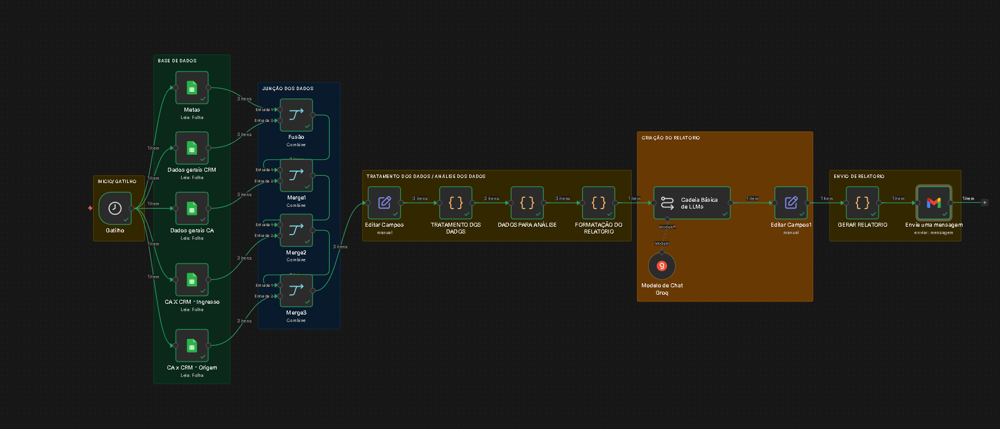
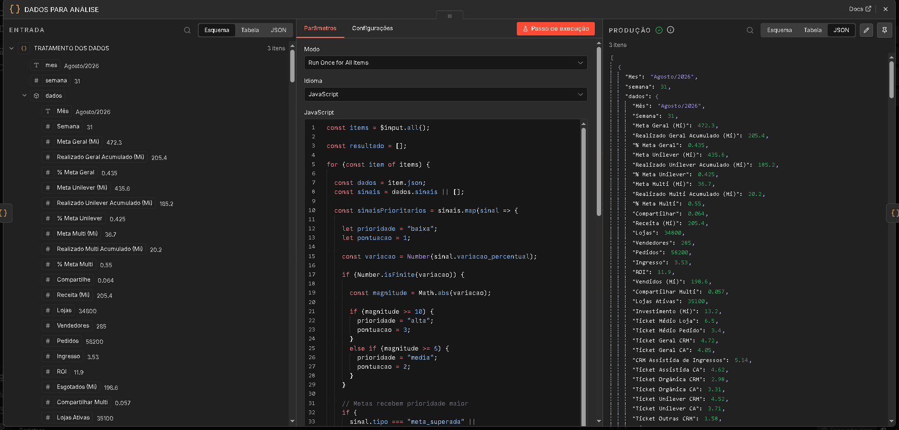
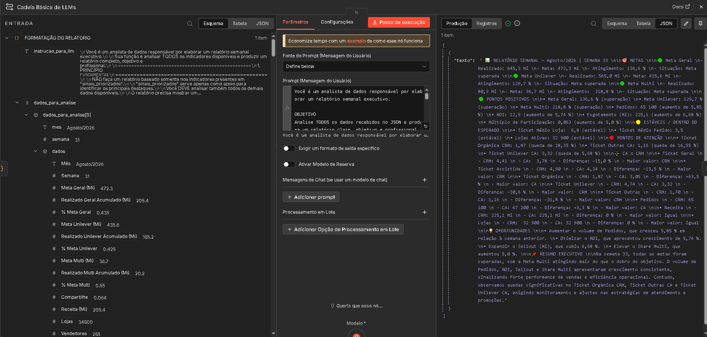
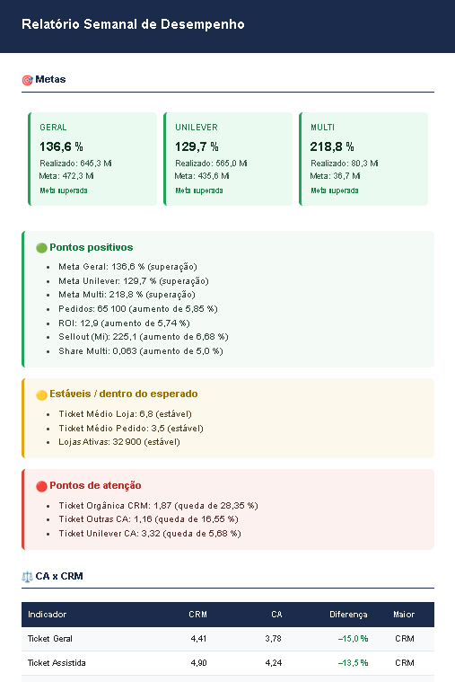
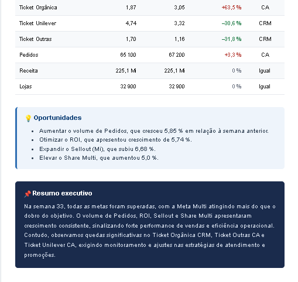

# Automação de Relatório Semanal com n8n + IA

Projeto de automação desenvolvido como parte do **TCC do programa de
Jovem Aprendiz**, com foco em **automação de processos, tratamento de
dados e Inteligência Artificial**.

> **Observação:** todos os dados disponibilizados neste repositório são
> fictícios e foram utilizados exclusivamente para demonstração do
> projeto.

------------------------------------------------------------------------

## 📌 Sobre o projeto

O projeto surgiu a partir de um processo semanal de elaboração de
relatório de indicadores que envolvia diversas etapas manuais de coleta,
organização, tratamento e interpretação dos dados.

A solução desenvolvida automatiza esse fluxo utilizando o **n8n**,
realizando o tratamento e preparação dos dados e utilizando uma **LLM**
para auxiliar na análise dos indicadores, identificação de pontos de
atenção, oportunidades e geração de um relatório estruturado.

O relatório final é convertido para **HTML** e enviado automaticamente
por e-mail.

------------------------------------------------------------------------

## 🎯 Problema

A elaboração manual do relatório exigia a reunião de informações
provenientes de diferentes conjuntos de dados, seguida de tratamento,
comparação de indicadores e interpretação dos resultados.

Esse processo poderia consumir tempo da equipe e também apresentar o
risco de algum indicador relevante não ser identificado durante a
análise.

A proposta foi automatizar as etapas repetitivas e estruturar o processo
em um único fluxo.

------------------------------------------------------------------------

## 💡 Solução

A automação foi construída no **n8n** e organizada em etapas:

1.  Disparo do workflow;
2.  Entrada dos diferentes conjuntos de dados;
3.  Junção das informações;
4.  Tratamento e organização dos dados;
5.  Preparação dos indicadores para análise;
6.  Identificação e priorização de sinais relevantes;
7.  Preparação do contexto para a LLM;
8.  Análise dos indicadores utilizando Inteligência Artificial;
9.  Geração do relatório;
10. Conversão do relatório para HTML;
11. Envio automático por e-mail.

------------------------------------------------------------------------

## 🔄 Arquitetura do workflow

O fluxo possui diferentes fontes de dados que são combinadas antes da
etapa de tratamento e análise.

As principais entradas utilizadas no projeto demonstrativo são:

-   Metas;
-   Dados gerais de CRM;
-   Dados gerais do Compra Agora (CA);
-   Comparativos CA x CRM --- Ingresso;
-   Comparativos CA x CRM --- Origem.

Depois da junção das informações, o workflow realiza o tratamento dos
dados e prepara o conteúdo que será utilizado pela etapa de análise com
LLM.

### Fluxo completo



------------------------------------------------------------------------

## 🧹 Tratamento e preparação dos dados

Antes de enviar as informações para a Inteligência Artificial, os dados
passam por etapas de processamento utilizando **JavaScript dentro do
n8n**.

Nessa etapa são realizadas operações como:

-   organização dos dados recebidos;
-   preparação dos indicadores;
-   cálculo e utilização de variações;
-   identificação de sinais relevantes;
-   priorização de indicadores;
-   estruturação do JSON utilizado pela etapa de análise.

Isso permite que a LLM receba um contexto estruturado em vez de
trabalhar diretamente com os dados brutos.



------------------------------------------------------------------------

## 🤖 Análise com Inteligência Artificial

Após o tratamento, os dados estruturados são enviados para uma **LLM**
por meio do fluxo do n8n.

A análise segue regras definidas no prompt para evitar a criação de
informações que não estejam presentes nos dados.

Entre os pontos analisados estão:

-   situação das metas;
-   pontos positivos;
-   indicadores estáveis;
-   pontos de atenção;
-   comparação CA x CRM;
-   oportunidades sustentadas pelos dados;
-   resumo executivo;
-   recomendações relacionadas aos indicadores encontrados.

A IA também recebe instruções para não inventar valores, percentuais ou
causas que não possam ser sustentados pelos dados fornecidos.



------------------------------------------------------------------------

## 📊 Resultado

Ao final do workflow, é gerado um relatório estruturado contendo as
principais informações da semana.

O relatório apresenta:

-   **Metas**;
-   **Pontos positivos**;
-   **Estáveis / dentro do esperado**;
-   **Pontos de atenção**;
-   **Comparativo CA x CRM**;
-   **Oportunidades**;
-   **Resumo executivo**.

O conteúdo é transformado em **HTML**, recebendo uma estrutura visual
própria antes do envio por e-mail.

### Relatório final





------------------------------------------------------------------------

## 🛠️ Tecnologias utilizadas

  -----------------------------------------------------------------------
  Tecnologia                          Utilização
  ----------------------------------- -----------------------------------
  **n8n**                             Orquestração e automação do
                                      workflow

  **JavaScript**                      Tratamento, organização e
                                      processamento dos dados

  **LLM / Inteligência Artificial**   Análise dos indicadores e geração
                                      de insights

  **Google Sheets / Excel**           Estruturação dos dados utilizados
                                      no projeto demonstrativo

  **HTML / CSS**                      Formatação visual do relatório

  **Gmail**                           Envio automático do relatório
  -----------------------------------------------------------------------

------------------------------------------------------------------------

## 📈 Indicadores trabalhados

O fluxo demonstrativo trabalha com diferentes indicadores, incluindo:

-   Receita;
-   Pedidos;
-   Ticket;
-   ROI;
-   Sellout;
-   Share;
-   Share Multi;
-   Lojas;
-   Lojas ativas;
-   Vendedores;
-   Investimento;
-   Metas Geral, Unilever e Multi;
-   Comparativos entre CA e CRM.

------------------------------------------------------------------------

## 📁 Estrutura do projeto

``` text
automacao-relatorio-semanal-n8n/
│
├── README.md
├── .gitignore
│
├── workflow/
│   └── workflow-relatorio-semanal.json
│
├── data/
│   └── dados-ficticios.json
│
├── docs/
│   ├── arquitetura.md
│   └── prompt-ia.md
│
└── images/
    ├── 01-fluxo-n8n.png
    ├── 02-tratamento-dados.png
    ├── 03-analise-ia.png
    ├── 04-relatorio-final-1.png
    └── 05-relatorio-final-2.png
```

------------------------------------------------------------------------

## 🚀 Como executar

### 1. Instale o n8n

O projeto utiliza o n8n para executar e orquestrar o workflow.

### 2. Importe o workflow

No n8n:

**Workflows → Import from File**

e selecione:

``` text
workflow/workflow-relatorio-semanal.json
```

### 3. Configure as credenciais

As credenciais utilizadas no projeto original não são disponibilizadas
neste repositório.

Para executar o workflow, é necessário configurar as próprias
credenciais dos serviços utilizados, como:

-   Google Sheets;
-   Gmail;
-   provedor de LLM.

### 4. Configure os dados

Utilize os dados fictícios disponíveis em:

``` text
data/dados-ficticios.json
```

Os identificadores de planilhas, e-mails e demais informações
específicas do ambiente original devem ser substituídos pelas
informações do próprio ambiente.

------------------------------------------------------------------------

## 🔐 Segurança e privacidade

Para publicação no GitHub, foram removidas informações específicas do
ambiente original.

Não devem ser publicados:

-   API Keys;
-   tokens;
-   senhas;
-   credenciais do n8n;
-   e-mails pessoais ou corporativos;
-   IDs reais de planilhas;
-   dados reais da empresa;
-   informações internas ou confidenciais.

Os dados presentes neste repositório são **fictícios**.

------------------------------------------------------------------------

## 🎓 Contexto acadêmico

Este projeto foi desenvolvido como parte do **TCC do programa de Jovem
Aprendiz**, tendo como objetivo aplicar conceitos de automação,
tratamento de dados e Inteligência Artificial na solução de um processo
que possuía etapas manuais.

Além do contexto acadêmico, o projeto também foi utilizado como
oportunidade para desenvolver conhecimentos práticos relacionados a:

-   automação de processos;
-   análise de dados;
-   manipulação de JSON;
-   JavaScript;
-   integração entre serviços;
-   utilização de LLMs;
-   geração de relatórios.

------------------------------------------------------------------------

## 📚 Aprendizados

Durante o desenvolvimento, alguns dos principais aprendizados foram:

-   estruturar workflows de automação;
-   trabalhar com múltiplas entradas de dados;
-   tratar e organizar dados utilizando JavaScript;
-   preparar contexto para modelos de linguagem;
-   criar regras para reduzir interpretações indevidas da IA;
-   transformar dados analisados em um relatório estruturado;
-   gerar HTML automaticamente;
-   integrar diferentes serviços em um único fluxo;
-   pensar em segurança e anonimização antes de publicar um projeto.

------------------------------------------------------------------------

## 👨‍💻 Projeto

Desenvolvido por **Luan Pitelli** como projeto acadêmico e de portfólio,
com foco em **Dados, Automação e Inteligência Artificial**.
